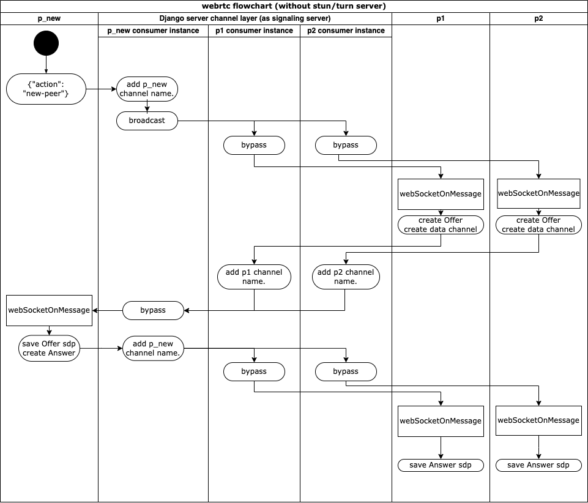

# WebRTC Chatroom (with webcam streaming)

### This django server work with Redis.   **Please run redis on localhost:6379**  本專案需配合redis運行。

## Introduction: 
A self study of building webrtc chatroom with streaming webcam.  
https://www.youtube.com/watch?v=MBOlZMLaQ8g  
Without https, this website can only work in localhost, or via ngrok and make it works on LAN. 
*由於沒有架設於https環境，且缺乏Stun/Turn server，理論上僅可支援localhost。本站透過ngrok，勉強能夠在LAN中運行。(stream video/audio會擋非https連線)*

## Installation:
1. redis:
   1. start docker 
   2. `docker run --name my-redis -p 6379:6379 -d redis`
   

2. Django server:
   1. clone source code
   2. `cd webrtcChatroom`
   3. `python -m venv venv`
   4. `source venv/bin/activate`
   5. `pip install -r requirements.txt`
   6. `python manage.py runserver 0.0.0.0:8000`

3. run [ngrok](https://ngrok.com/) and use the https links:
   1. `ngrok http 8000`

   
## Study Notes:
### [1. Django channels](https://channels.readthedocs.io/en/stable/):
#### intro:
[Django Channels](https://channels.readthedocs.io/en/stable/) is an app that allows client start a web socket connection with django server. 
It also allows developer define behaviours of server whenever the server get message from client. 
*Django channel 的應用使開發者能夠在同一個頁面上埋入websocket的功能。
比起http一次query即結束工作的方式，web socket提供一個長時間的連線，用以實踐server對client端的資料即時更新與主動通知等功能。
常見的應用有線上聊天室、聊天忌器人等。*

[Django channels](https://channels.readthedocs.io/en/stable/) support since django v3.0 when ASGI support available. 
It doesn't mean you can't use channels with django2, it just needs more setup work with it.

  

There are some files to create and setup for django channels to run.
I'll try to explain the character of each file, and what they do.  
*以下提供一些建立django channels會用到的檔案，以及他們在連線中扮演的角色。*

1. **"consumers.py"**: Under app file. This is somehow works like views.py file, but for the websocket.
Everytime when a new connection is created, a new consumer instance will be created, and be responsible to handle the receiving data from client.  
What special is these consumer instances can communicate with each other.  
By using channel_layer commends like `self.channel_layer.send()`or `self.channel_layer.group_send()`, one consumer can pass message to the client on another web socket connection.
The consumer instance will be killed after the connection is closed.  
*Consumer 是用來handle使用者回傳socket message的，類似機器人(或者類似view.py)的class。
在每次client連線建立時，會生成一個consumer的實體來服務這支連線。
每個實體會有獨立的channel_name；或多個channel會屬於共同的channel_group。
Server也能以channel_group或channel_name來指定或廣播需要接收訊息的連線，用來實現跨連嫌通訊。*

2. **"webrtcChatroom/asgi.py"**: Under core file. To handle different protocols (like http, ws...), 
asgi.py define which direct file (such as urls.py or routing.py) will request used.  
*asgi.py 定義了要如何處置以不同協定連線進來的client。*
*最陽春的django僅支援http，因此初始的asgi.py也只將http mapping到urls.py。*
*在使用channel時，我們需要將websocket mapping到routing.py。routing.py將control 後續 request的去向。*

3. **routing.py**: This is like urls.py file for web socket. 
It maps different consumers (we can write many consumers for different cases) to connections that came from different url. 
*類似於原本django架構中的urls.py，透過client channel連進來的路徑，可以指定不同的consumer來服務該連線。
(開發人員能夠撰寫多種consumer來應對不同的服務。)*

Also, there are some more setting when using channels. 
Please follow the [tutorial](https://www.youtube.com/watch?v=MBOlZMLaQ8g) step by step.
 
*詳細設置請觀看tutorial。*

#### Case study:
In this project, our django channels are used for sdp exchanging.
sdp (Session Description Protocol) is like a personal information pack. 
Two peers need sdp form each other for creating p2p connection. 
*此實作中，django channels作為Signaling server使用，用來幫peers交換互相的sdp。
是其中一種較為復蓻的應用方式。*

We only got one page on this site, so we keep path in urls.py & routing.py with "</empty string>".  
Also we map our websockets end point to class ChatConsumer written in consumers.py.

In the consumers.py, we define reaction of server when "connect", "disconnect", "receive".
"connect" & "disconnect" are simple. 

About the behavior in "receive", we'll describe it when we go throw the webrtc part. 
*consumer中的receive method 較為複雜，關係到WebRTC的交握行為設計。下面才會談到。*

  

### [2. Web RTC](https://webrtc.org/): 
#### intro:
Web RTC (real-time communication) allows user create p2p connections via javascript running on browser. 
It supports video, voice, and generic data to be sent between peers. 
I'll describe some terms and objects we may use later.  
*現今的網站為了提供更加及時的通訊服務而有了此技術，用來在瀏覽器上，以js實現p2p連線的各式資料交換。
舉凡video, voice, message皆可以Web RTC直接傳送到接收房而不需經過中間伺服器。 
以下對於一些相關名詞做解說。*

1. [sdp: (Session Description Protocol)](https://en.wikipedia.org/wiki/Session_Description_Protocol). 
Info of connection exchange between peers before connection success. 
There are offer-sdp & answer-sdp. 
[reference.](https://ithelp.ithome.com.tw/articles/10244443)  
*sdp類似於peer端的門票資訊，包含連線位置、port、類型等等。根據rtc協定中的交握階段，sdp又分為offer-sdp & answer-sdp。*

2. [RTCPeerConnection: ](https://ithelp.ithome.com.tw/articles/10243217) An interface represents a WebRTC connection between the local computer and a remote peer. 
It provides methods to connect to a remote peer, maintain and monitor the connection, and close the connection once it's no longer needed. 
*連線的api統稱，可以當作js中的一個連線物件。*

3. [Data Channel: ](https://ithelp.ithome.com.tw/articles/10246260) Channel under peer connection. 
A peer connection can have multiple data channel for different usage. 
(such as message & stream at same time)  
*可以在一個RTCPeerConnection中開啟多個data channel，用來傳輸不同的data*

4. [ICE(Interactive Connectivity Establishment): ](https://ithelp.ithome.com.tw/articles/10209725)
是一種在NAT上打洞的技術。技術中會遇到幾個角色：
   1. peer: 客戶端
   2. Stun server: (本次實作不會用到) 用來回覆peer，使peer知道他目前使用的連線真實ip:port為何，使peer能夠建立自身的sdp。
   3. Turn server: (本次實作不會用到) 當p2p連線失敗時所使用的跳板server，以bypass的方式維持連線。
   4. Signaling server: 一個用來讓雙方peer夠交換彼此sdp的server。(即為本次實作的django server的作用)
   
5. icecandidate: 候選的連線方式。在peer訪問Stun server後，會有一個(或多個，NAT有時候不止一層，且種類繁多)外部的連線方式。
再加上local ip等。以上的連線方式都是ice 的 candidate。這些candidate會被打包成sdp，透過Signaling server傳送給remote peer。
remote peer則會從裡面嘗試連線。

#### [steps of building connection between peers](https://ithelp.ithome.com.tw/articles/10209725):
Steps before peers connections build is just like the handshake in http.   
Let say, there are 2 peers in a chatroom, as p1 & p2.  
There is a third peer name p_new is intent to join this chatroom.  
*連線的建立類似於handshake，透過Signaling server交換彼此的sdp。
以下的流程說明與流程圖情境如：現有p1與p2已經建立連線在一個聊天群組中，p_new為欲加入的新peer。 *
***本次實作中沒有架設Stun/Turn server，因此流程有過簡化。***   
*check the source code in static/js/main.js*

1. p_new send a message with a key-value like message {"action":new-peer} to django server.  
   *p_new 傳送字串{"action":"new-peer"}給django server。*
2. consumer receive the message and broadcast to other related ws channels by channel layer api.  
   *django server 由consumer 接收字串處理。辨識出為"new-peer"要求後，將字串綁入consumer_name後，broadcast給p1/p2。*
3. After other peers (p1&p2) get the message, they do several things:
   1. create a RTCPeerConnection waiting for p_new connecting.  
   *p1/p2在瀏覽器中建立RTCPeerConnection。*
   2. Attach local track to RTCPeerConnection.  
   *p1/p2將自己的webcam畫面放入RTCPeerConnection。*
   3. create a data channel for message chat.  
   *在RTCPeerConnection內建立一個新的data channel給聊天室使用。*
   4. Create a empty video block on html for peer and attach RTCPeerConnection to peer video block.  
   *建立video block等待連線建立。*
   5. push p_new's connection & data channel into a mapPeers object, with p_new's username as key.  
   *將p_new相關資訊儲存起來。*
   6. create its own sdp & save in local. (`peer.createOffer()`)  
   *生成自己的offer sdp並儲存。*
   7. send the offer-sdp with action "new-offer" back to django server.  
   *將剛剛生成的offer sdp傳送給django server，指定要將訊息傳給p_new。*
4. Django server is now supposed to receiver two "new-offer" from p1 & p2. Server add the channel name (of p1/p2) to the message and pass to p_new.  
   *Server 收到"new-offer"後，個別加入傳送者的channel_name，再將其傳送給p_new。*
5. p_new do several things after receiving message with action "new-offer":
   1. create a RTCPeerConnection waiting for p1/p2. (So there will have 2 RTCPeerConnection in this case.) 
   *p_new在瀏覽器中建立RTCPeerConnection。*
   2. Attach local track to RTCPeerConnection. 
   *p_new同樣將webcam畫面放入RTCPeerConnection。*
   3. create a empty video block on html for peer and attach RTCPeerConnection to peer video block. 
   *建立video block等待連線建立。*
   4. Add event listener "datachannel" to peer connection; This is a event trigger when a data channel created by peer. 
   *在RTCPeerConnection中加入datachannel的觸發事件，用來處理對方建立新的data channel時的回覆。*
   5. set offer-sdp receive from "new-offer" 
   *將收到的sdp存入peer connection*
   6. create its own sdp & save in local. (`peer.createAnswer()`)  
   *生成自己的answer sdp並儲存。*
   7. send the answer-sdp with action "new-answer" back to django server. 
   *將剛剛生成的answer sdp傳送給django server，指定要將訊息傳給p1/p2。*
6. Django server is now supposed to receiver two "new-answer" from p_new.   Server add the channel name (of p_new) to the message and pass to p1/p2. 
*Server 收到"new-answer"後，加入p_new的channel_name，再將其個別傳送給p1/p2。*
7. p1/p2 both save the answer-sdp to the RTCPeerConnection, and this makes the connection open between peers. 
*p1/p2將接收到p_new的sdp，俵將棋attach到peer connection中，系統集會開始嘗試連線。*
