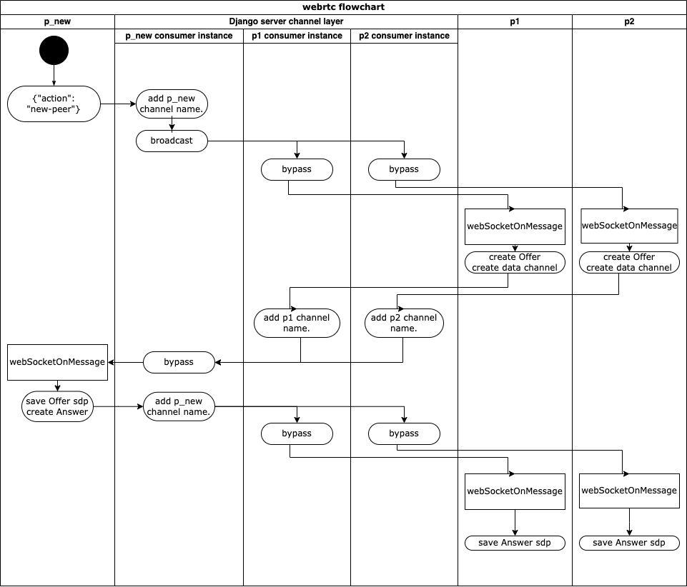

# Web RTC Chatroom

### This django server work with Redis.   **Please run redis on localhost:6379**

## Introduction: 
A self study of building webrtc chatroom with streaming webcam.  
https://www.youtube.com/watch?v=MBOlZMLaQ8g  
Without https, this website can only work in localhost, or via ngrok and make it works on LAN.

## Installation:
1. redis:
   1. start docker 
   2. `docker run --name my-redis -p 6379:6379 -d redis`
   

2. Django server:
   1. clone source code
   2. `cd webrtcChatroom`
   3. `python -m venv venv`
   4. `source venv/bin/activate`
   5. `pip install -r requirements.txt`
   6. `python manage.py runserver 0.0.0.0:8000`

3. run ngrok:
   1. `ngrok http 8000`

   
## Study Notes:
### [Django channels](https://channels.readthedocs.io/en/stable/):
#### intro:
[Django Channels](https://channels.readthedocs.io/en/stable/) is an app that allows client start a web socket connection with django server. 
It also allows developer define behaviours of server whenever the server get message from client.

[Django channels](https://channels.readthedocs.io/en/stable/) support since django v3.0 when ASGI support available. 
It doesn't mean you can't use channels with django2, it just needs more setup work with it.

  

There are some files to create and setup for django channels to run.
I'll try to explain the character of each file, and what they do.

1. **"consumers.py"**: This is somehow works like views.py file, but for the websocket.
Everytime when a new connection is created, a new consumer instance will be created, and be responsible to handle the receiving data from client.  
What special is these consumer instances can communicate with each other.  
By using channel_layer commends like `self.channel_layer.send()`or `self.channel_layer.group_send()`, one consumer can pass message to the client on another web socket connection.
The consumer instance will be killed after the connection is closed.

2. **"asgi.py"**: To handle different protocols (like http, ws...), 
asgi.py define which direct file (such as urls.py or routing.py) will request used.

3. **routing.py**: This is like urls.py file for web socket. 
It maps different consumers (we can write many consumers for different cases) to connections that came from different url.

Also, there are some more setting when using channels. 
Please follow the [tutorial](https://www.youtube.com/watch?v=MBOlZMLaQ8g) step by step.
 

#### Case study:
In this project, our django channels are used for sdp exchanging.
sdp (Session Description Protocol) is like a personal information pack. 
Two peers need sdp form each other for creating p2p connection.

We only got one page on this site, so we keep path in urls.py & routing.py with "</empty string>".  
Also we map our websockets end point to class ChatConsumer written in consumers.py.

In the consumers.py, we define reaction of server when "connect", "disconnect", "receive".
"connect" & "disconnect" are simple. 

About the behavior in "receive", we'll describe it when we go throw the webrtc part.

  

### [Web RTC](https://webrtc.org/): 
#### intro:
Web RTC (real-time communication) allows user create p2p connections via javascript running on browser. 
It supports video, voice, and generic data to be sent between peers. 
I'll describe some terms and objects we may use later.
1. sdp: 
2. data channel
3. audioTrack/videoTrack
4. RTCPeerConnection
5. icecandidate

#### steps of building connection between peers:
Steps before peers connections builded is just like the handshake in http.   
Let say, there are 2 peers in a chatroom, as p1 & p2.  
There is a third peer name p_new is intent to join this chatroom.

1. p_new send a message with a key-value like message {"action":new-peer} to django server.
2. consumer receive the message and broadcast to other related ws channels by channel layer api.
3. After other peers (p1&p2) get the message, they do several things:
   1. create a RTCPeerConnection waiting for p_new connecting.
   2. Attach local track to RTCPeerConnection.
   3. create a data channel for message chat.
   4. create a empty video block on html for peer.
   5. Attach RTCPeerConnection to peer video block
   6. push p_new's connection & data channel into a mapPeers object, with p_new's username as key.
   7. create its own sdp & save in local. (`peer.createOffer()`)
   8. send the offer-sdp with action "new-offer" back to django server.
4. Django server is now supposed to receiver two "new-offer" from p1 & p2.   Server add the channel name (of p1/p2) to the message and pass to p_new.
5. p_new do several things after receiving message with action "new-offer":
   1. create a RTCPeerConnection waiting for p1/p2. (So there will have 2 RTCPeerConnection in this case.)
   2. Attach local track to RTCPeerConnection.
   3. create a empty video block on html for peer.
   4. Attach RTCPeerConnection to peer video block.
   5. Add event listener "datachannel"; this is a event trigger when a data channel created by peer.
   6. set offer-sdp receive from "new-offer"
   7. create its own sdp & save in local. (`peer.createAnswer()`) 
   8. send the answer-sdp with action "new-answer" back to django server.
6. Django server is now supposed to receiver two "new-answer" from p_new.   Server add the channel name (of p_new) to the message and pass to p1/p2.
7. p1/p2 both save the answer-sdp to the RTCPeerConnection, and this makes the connection open between peers.
